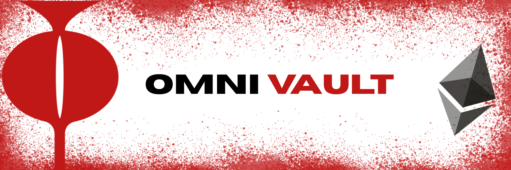

<p align="center">
  
</p>

<h1 align="center">Omni-Vault</h1>

<p align="center">
  A vault-style DeFi yield aggregator built on ERC-4626-inspired accounting, powered by AI-driven allocation and confidential execution via iExec NOX.
</p>

<p align="center">
  
  
  
  
  
</p>

---

## Table of Contents

- [Overview](#overview)
- [Architecture](#architecture)
- [Smart Contracts](#smart-contracts)
  - [MetaVault.sol](#metavaultsol)
  - [StrategyBase.sol](#strategybasesol)
  - [AaveStrategy.sol](#aavestrategy sol)
  - [CompoundStrategy.sol](#compoundstrategysol)
  - [NoxStrategy.sol](#noxstrategysol)
  - [Harvester.sol](#harvestersol)
- [Frontend](#frontend)
- [Business Model](#business-model)
- [Testing on Sepolia](#testing-on-sepolia)
- [Known Limitations](#known-limitations)
- [Mainnet Readiness](#mainnet-readiness)
- [Built by](#built-by)

---

## Overview

Omni-Vault is a non-custodial DeFi yield aggregator. Users deposit USDC into a central vault contract (`MetaVault`) and receive vault shares proportional to their contribution. The vault routes capital across multiple yield strategies — Aave V3, Compound V3, and iExec NOX — with allocations determined by an AI model (ChainGPT) and executed confidentially via the iExec TEE network.

Users can deposit, monitor their position in real time, and withdraw at any time by redeeming their shares. A performance fee (10% on profit only) is collected at withdrawal and sent to a configurable `feeRecipient` address.

> **Note:** The current version in this repository does not automatically route deposited funds into strategy contracts. Strategy allocations are tracked and queryable, but the full deposit-to-strategy orchestration pipeline requires additional implementation. See [Known Limitations](#known-limitations) for details.

---

## Architecture

The system is organized across four layers:

```
User Interface (React + wagmi + RainbowKit)
        |
        |  approve + deposit / withdraw(shareAmount)
        v
MetaVault.sol  <----  Harvester.sol  <----  ChainGPT (AI allocator)
        |
        |  strategy.deposit() / strategy.withdraw()
        v
  +-----------------+-----------------------+
  |                 |                       |
AaveStrategy   CompoundStrategy        NoxStrategy
  |                 |                       |
Aave V3 Pool   Compound V3 Comet    iExec TEE Oracle
```

**Data flow at deposit:**
1. User approves USDC spend on `MetaVault`.
2. `MetaVault.deposit(amount)` transfers USDC in, mints shares using the `(amount * totalShares) / totalBefore` formula, and records `depositedAmount[user]`.

**Data flow at withdrawal:**
1. `MetaVault.withdraw(shareAmount)` computes `payout = totalAssets() * shareAmount / totalShares`.
2. Principal attribution: `principal = depositedAmount[user] * shareAmount / shares[user]`.
3. Profit above principal is subject to a 10% performance fee sent to `feeRecipient`.
4. Remaining USDC is transferred to the user; shares and principal records are burned.

**totalAssets() composition:**
```
totalAssets() = asset.balanceOf(MetaVault)
              + AaveStrategy.totalAssets()      // aToken balance
              + CompoundStrategy.totalAssets()  // comet.balanceOf(this)
              + NoxStrategy.totalAssets()       // stakedAmount + reportedYield
```

---

## Smart Contracts

### MetaVault.sol

The core vault contract. Holds USDC, tracks shares and principal, and manages strategy configuration.

| State Variable | Type | Description |
|---|---|---|
| `asset` | `IERC20` | Underlying token (USDC) |
| `totalShares` | `uint256` | Sum of all minted shares |
| `shares[user]` | `mapping` | Per-user share balance |
| `depositedAmount[user]` | `mapping` | Per-user principal for profit fee accounting |
| `strategies[]` | `address[]` | Registered strategy addresses |
| `allocations[]` | `uint256[]` | Per-strategy allocation in basis points (sum = 10000) |
| `performanceFee` | `uint256` | Default 1000 bps (10%) |
| `feeRecipient` | `address` | Address that receives profit fees |

Key methods: `deposit`, `withdraw`, `totalAssets`, `sharePrice`, `getUserValue`, `rebalance`, `addStrategy`.

**Share price formula:**
```
sharePrice = totalAssets() * 1e18 / totalShares
```

---

### StrategyBase.sol

Abstract base contract for all strategies. Enforces `onlyVault` access control on `deposit` and `withdraw`. Pulls tokens from the vault via `transferFrom` on deposit, and returns them via `transfer` on withdrawal. Concrete strategies implement `_depositToProtocol` and `_withdrawFromProtocol`.

---

### AaveStrategy.sol

Deposits USDC into the Aave V3 lending pool on Sepolia and holds `aUSDC` (interest-bearing token).

| Constant | Value |
|---|---|
| `AAVE_POOL` | `0x6Ae43d3271ff6888e7Fc43Fd7321a503ff738951` |
| `A_USDC` | `0x16dA4541aD1807f4443d92D26044C1147406EB80` |

`totalAssets()` returns `aToken.balanceOf(address(this))`.

---

### CompoundStrategy.sol

Supplies USDC to the Compound V3 Comet market on Sepolia.

| Constant | Value |
|---|---|
| `COMET_USDC` | `0xAec1F48e02Cfb822Be958B68C7957156EB3F0b6e` |

`totalAssets()` returns `comet.balanceOf(address(this))`.

---

### NoxStrategy.sol

Represents an off-chain confidential yield execution model powered by iExec NOX (TEE). Yield is not automatically accrued; it is reported on-chain by an authorized oracle via `submitYieldReport(yieldAmount, signature)`.

Signature verification uses:
```solidity
keccak256(abi.encodePacked(yieldAmount, block.chainid, address(this)))
```
wrapped with `toEthSignedMessageHash()` and checked against `authorizedOracle`.

`totalAssets()` returns `stakedAmount + reportedYield`.

---

### Harvester.sol

A permissionless harvest trigger and owner-only rebalance wrapper.

- `harvest()` — records timestamp and emits an event. Does not currently trigger strategy actions.
- `rebalance(newAllocations)` — owner-only. Calls `MetaVault.rebalance(newAllocations)` to update allocation weights.

---

## Frontend

Built with React, [wagmi](https://wagmi.sh), [viem](https://viem.sh), [RainbowKit](https://www.rainbowkit.com), and [TanStack Router](https://tanstack.com/router).

### Contract Addresses (Sepolia)

| Contract | Address |
|---|---|
| MetaVault | `0x7dc508aC5EE4c9D864c0f1A1514efADD8295f76d` |
| Mock USDC | `0xA9cA4740f15353c040C68eF4EB2a759A8E4F483D` |

### Dashboard Reads (`useVaultStats`)

- `totalAssets` — `MetaVault.totalAssets()`
- `sharePrice` — `MetaVault.sharePrice()`
- `userShares` — `MetaVault.shares(user)`
- `userValue` — `MetaVault.getUserValue(user)`

### PnL Calculation (`useUserPnL`)

```
pnl        = getUserValue(user) - depositedAmount[user]
pnlPercent = pnl / depositedAmount[user] * 100
```

### Deposit Flow

1. `USDC.approve(MetaVault, amount)` if allowance is insufficient.
2. `MetaVault.deposit(amount)`.

### Withdrawal Flow

User selects a percentage of their shares using a slider. The UI computes:
```
shareAmount = shares * percent / 100
```
then calls `MetaVault.withdraw(shareAmount)`.

### History

`useVaultActivity` fetches on-chain `Deposit` and `Withdraw` event logs using `publicClient.getLogs()` and renders them as an activity feed.

---

## Business Model

### Performance Fee

The only enforced fee mechanism is a performance fee on realized profit at withdrawal:

```
profit = payout - principal          // only charged if payout > principal
fee    = profit * performanceFee / 10000
```

- Default rate: **10%** (1000 basis points).
- Fee is only charged on profit, never on the principal or on losses.
- `feeRecipient` is configurable by the vault owner.

### AI-Driven Allocation

ChainGPT selects allocation weights across registered strategies. Allocations are applied via `Harvester.rebalance()` → `MetaVault.rebalance(newAllocations)`. In a fully wired deployment, rebalancing also moves capital between the vault and strategy contracts.

### Confidential Execution

The NoxStrategy contract represents the on-chain accounting surface of an iExec TEE-executed yield model. Yield reports are signed by an authorized oracle and submitted via `submitYieldReport()`.

---

## Testing on Sepolia

```bash
npm run dev
```

1. Connect your wallet and switch to Sepolia (chainId `11155111`).
2. Mint Mock USDC from the token contract.
3. In the app, approve and deposit USDC into MetaVault.
4. Simulate yield by transferring additional Mock USDC directly to the MetaVault address:
   ```
   0x7dc508aC5EE4c9D864c0f1A1514efADD8295f76d
   ```
   This increases `totalAssets()`, raising `sharePrice` and `getUserValue` without altering `shares` or `depositedAmount` — producing positive PnL.
5. Withdraw from the app. Observe USDC returned minus the 10% performance fee on profit.

See `SEPOLIA_TESTING_GUIDE.txt` for the complete walkthrough.

---

## Known Limitations

**Incomplete fund routing.** `MetaVault.deposit()` and `MetaVault.rebalance()` do not currently call `strategy.deposit()`. Funds remain in the vault's direct balance unless routed separately.

**Harvest does not realize yield.** `Harvester.harvest()` only records a timestamp and emits an event. It does not trigger yield claiming or strategy rebalancing.

**Sepolia-only.** All protocol addresses are hardcoded for Sepolia testnet. Mainnet deployment requires contract redeployment and address updates.

**Profit fee accounting assumes linear principal tracking.** The `depositedAmount` approach works correctly for the current simplified model but requires careful review in compounding or multi-deposit scenarios.

**Token is USDC (ERC-20), not ETH.** ETH is used only for gas. All deposits and withdrawals are denominated in USDC.

---

## Mainnet Readiness

To deploy Omni-Vault in a production environment:

- Redeploy MetaVault and all strategy contracts on mainnet.
- Update `METAVAULT_ADDRESS` and `USDC_ADDRESS` in `src/lib/contracts.ts`.
- Update all protocol addresses in strategy contracts to mainnet equivalents.
- Implement full on-chain fund routing:
  - During deposit and/or rebalance: call `StrategyBase.deposit(allocatedAmount)` per strategy.
  - During withdrawal: withdraw sufficient liquidity from strategies before transferring to the user.
- Implement yield harvesting/claiming if required by the underlying protocols.
- Audit all contracts before mainnet deployment.

---


<p align="start">

  <strong>Riz'lers</strong> 
</p>