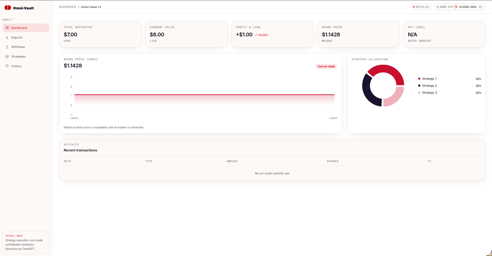
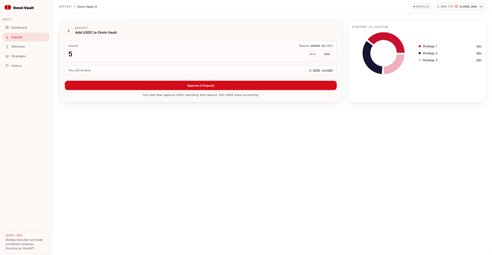
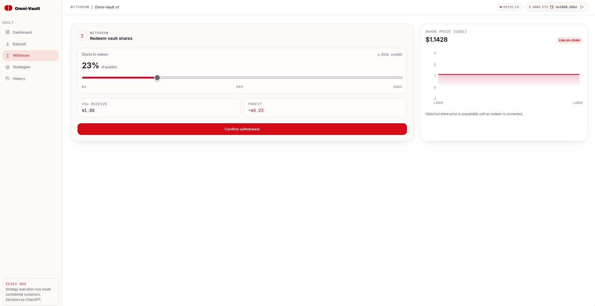
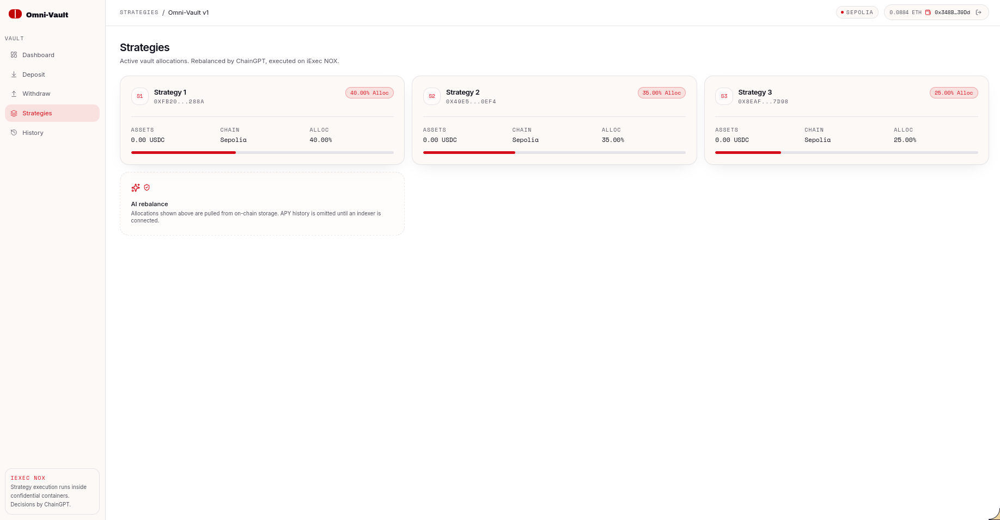
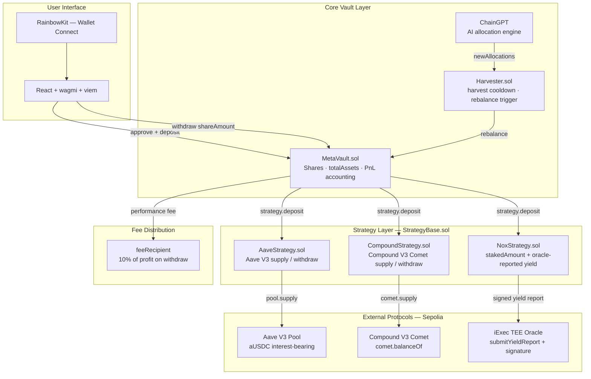

<p align="center">
  
</p>

<h1 align="center">Omni-Vault</h1>

<p align="center">
  A vault-style DeFi yield aggregator built on ERC-4626-inspired accounting,<br/>
  powered by AI-driven allocation (ChainGPT) and confidential execution (iExec NOX).
</p>

<p align="center">
  
  
  
  
  
</p>

---

## Table of Contents

- [Overview](#overview)
- [Screenshots](#screenshots)
- [Architecture](#architecture)
- [Smart Contracts](#smart-contracts)
  - [MetaVault.sol](#metavaultsol)
  - [StrategyBase.sol](#strategybasesol)
  - [AaveStrategy.sol](#aavestrategy)
  - [CompoundStrategy.sol](#compoundstrategy)
  - [NoxStrategy.sol](#noxstrategy)
  - [Harvester.sol](#harvestersol)
- [Frontend](#frontend)
- [Business Model](#business-model)
- [Testing on Sepolia](#testing-on-sepolia)
- [Known Limitations](#known-limitations)
- [Mainnet Readiness](#mainnet-readiness)
- [Built by](#built-by)

---

## Overview

Omni-Vault is a non-custodial DeFi yield aggregator. Users deposit USDC into a central vault contract (`MetaVault`) and receive vault shares proportional to their contribution. The vault routes capital across multiple yield strategies — Aave V3, Compound V3, and iExec NOX — with allocations determined by ChainGPT and executed confidentially via the iExec TEE network.

Users can deposit, monitor their position in real time, and withdraw at any time by redeeming their shares. A performance fee of 10% is collected on profit only at the point of withdrawal and forwarded to a configurable `feeRecipient` address.

> **Note:** In the current repository version, deposited funds are not automatically routed into strategy contracts. Strategy allocations are tracked and queryable on-chain, but the full deposit-to-strategy orchestration pipeline requires additional implementation. See [Known Limitations](#known-limitations).

---

## Screenshots

<table>
  <tr>
    <td align="center" width="50%">
      <b>Landing Page</b><br/><br/>
      
    </td>
    <td align="center" width="50%">
      <b>Dashboard</b><br/><br/>
      
    </td>
  </tr>
  <tr>
    <td align="center" width="50%">
      <b>Deposit</b><br/><br/>
      
    </td>
    <td align="center" width="50%">
      <b>Withdraw</b><br/><br/>
      
    </td>
  </tr>
  <tr>
    <td align="center" colspan="2">
      <b>Strategies</b><br/><br/>
      
    </td>
  </tr>
</table>

---

## Architecture



---

## Smart Contracts

### MetaVault.sol

The core vault contract. Holds USDC, tracks shares and principal per user, and manages strategy allocation configuration.

| State Variable | Type | Description |
|---|---|---|
| `asset` | `IERC20` | Underlying token (USDC) |
| `totalShares` | `uint256` | Sum of all outstanding shares |
| `shares[user]` | `mapping` | Per-user share balance |
| `depositedAmount[user]` | `mapping` | Per-user principal for fee accounting |
| `strategies[]` | `address[]` | Registered strategy addresses |
| `allocations[]` | `uint256[]` | Per-strategy weight in basis points (sum = 10000) |
| `performanceFee` | `uint256` | 1000 bps default (10%) |
| `feeRecipient` | `address` | Recipient of collected profit fees |

**Share minting:**
```
newShares = totalShares == 0
          ? amount
          : (amount × totalShares) / totalAssets()
```

**Share price:**
```
sharePrice = totalAssets() × 1e18 / totalShares
```

**`totalAssets()` composition:**
```
totalAssets() = asset.balanceOf(MetaVault)
              + AaveStrategy.totalAssets()
              + CompoundStrategy.totalAssets()
              + NoxStrategy.totalAssets()
```

---

### StrategyBase.sol

Abstract base contract. Enforces `onlyVault` on `deposit` and `withdraw`. Pulls tokens from the vault via `transferFrom` on deposit and returns them via `transfer` on withdrawal. Concrete strategies implement `_depositToProtocol` and `_withdrawFromProtocol`.

---

### AaveStrategy

Deposits USDC into the Aave V3 lending pool and holds `aUSDC`.

| Constant | Value |
|---|---|
| `AAVE_POOL` | `0x6Ae43d3271ff6888e7Fc43Fd7321a503ff738951` |
| `A_USDC` | `0x16dA4541aD1807f4443d92D26044C1147406EB80` |

`totalAssets()` returns `aToken.balanceOf(address(this))`.

---

### CompoundStrategy

Supplies USDC to the Compound V3 Comet USDC market.

| Constant | Value |
|---|---|
| `COMET_USDC` | `0xAec1F48e02Cfb822Be958B68C7957156EB3F0b6e` |

`totalAssets()` returns `comet.balanceOf(address(this))`.

---

### NoxStrategy

On-chain accounting surface for an iExec TEE confidential yield model. Yield is submitted by an authorized oracle via `submitYieldReport(yieldAmount, signature)`.

**Signature scheme:**
```solidity
keccak256(abi.encodePacked(yieldAmount, block.chainid, address(this)))
// wrapped with toEthSignedMessageHash(), verified against authorizedOracle
```

`totalAssets()` returns `stakedAmount + reportedYield`.

---

### Harvester.sol

- `harvest()` — permissionless. Records timestamp, emits event. Does not currently trigger strategy yield actions.
- `rebalance(newAllocations)` — owner-only. Calls `MetaVault.rebalance(newAllocations)` to update allocation weights.

---

## Frontend

Built with React, [wagmi](https://wagmi.sh), [viem](https://viem.sh), [RainbowKit](https://www.rainbowkit.com), and [TanStack Router](https://tanstack.com/router).

### Contract Addresses (Sepolia)

| Contract | Address |
|---|---|
| MetaVault | `0x7dc508aC5EE4c9D864c0f1A1514efADD8295f76d` |
| Mock USDC | `0xA9cA4740f15353c040C68eF4EB2a759A8E4F483D` |

### Dashboard Reads

`useVaultStats` reads `totalAssets`, `sharePrice`, `userShares`, and `getUserValue` on every block.

`useUserPnL` computes:
```
pnl        = getUserValue(user) - depositedAmount[user]
pnlPercent = pnl / depositedAmount[user] × 100
```

### Deposit Flow

1. `USDC.approve(MetaVault, amount)` if current allowance is insufficient.
2. `MetaVault.deposit(amount)`.

### Withdrawal Flow

User selects a share percentage via slider. The UI computes `shareAmount = userShares × percent / 100` and calls `MetaVault.withdraw(shareAmount)`.

### Activity History

`useVaultActivity` fetches `Deposit` and `Withdraw` event logs via `publicClient.getLogs()` and renders them as a chronological activity feed.

---

## Business Model

### Performance Fee

The only enforced on-chain fee is a performance fee on realized profit at withdrawal:

```
profit = payout - principal    // only when payout > principal
fee    = profit × performanceFee / 10000
```

- Default rate: **10%** (1000 bps)
- No fee charged on losses or on the principal component
- `feeRecipient` is configurable by the vault owner

### AI-Driven Allocation

ChainGPT selects basis-point weights across registered strategies. Weights are applied through `Harvester.rebalance()` → `MetaVault.rebalance(newAllocations)`. In a fully wired deployment, this also moves capital between the vault and each strategy.

### Confidential Execution

`NoxStrategy` is the on-chain surface for an iExec TEE-executed yield model. All yield computations occur off-chain inside a trusted execution environment and are submitted on-chain as signed oracle reports via `submitYieldReport(yieldAmount, signature)`.

---

## Testing on Sepolia

```bash
npm run dev
```

1. Connect your wallet and switch to Sepolia (`chainId 11155111`).
2. Mint Mock USDC from `0xA9cA4740f15353c040C68eF4EB2a759A8E4F483D`.
3. Approve and deposit USDC in the app.
4. Simulate yield by transferring additional Mock USDC directly to the MetaVault:
   ```
   0x7dc508aC5EE4c9D864c0f1A1514efADD8295f76d
   ```
   This increases `totalAssets()` — raising `sharePrice` and `getUserValue` — without changing `shares` or `depositedAmount`, producing positive PnL.
5. Withdraw from the app. USDC returned will reflect the 10% performance fee deducted from profit.

See [`SEPOLIA_TESTING_GUIDE.txt`](./SEPOLIA_TESTING_GUIDE.txt) for the complete walkthrough.

---

## Known Limitations

**Incomplete fund routing.** `MetaVault.deposit()` and `MetaVault.rebalance()` do not call `strategy.deposit()`. Funds remain in the vault's direct USDC balance unless routed through a separate mechanism.

**Harvest does not realize yield.** `Harvester.harvest()` records a timestamp and emits an event only. It does not trigger strategy yield claiming or rebalancing.

**Sepolia-only.** All protocol addresses are hardcoded for Sepolia testnet. Mainnet deployment requires full contract redeployment and address updates across all files.

**Linear principal tracking.** The `depositedAmount` accounting works correctly for the current simplified model but requires careful review under compounding or multiple sequential deposit scenarios.

**ERC-20 only.** MetaVault is non-payable. All deposits and withdrawals are in USDC. ETH is used for gas only.

---

## Mainnet Readiness

To run Omni-Vault in production:

- Redeploy MetaVault and all strategy contracts on mainnet.
- Update `METAVAULT_ADDRESS` and `USDC_ADDRESS` in `src/lib/contracts.ts`.
- Replace all Sepolia protocol addresses in strategy contracts with mainnet equivalents.
- Implement on-chain fund routing: call `StrategyBase.deposit(allocatedAmount)` per strategy during deposit and rebalance; call `strategy.withdraw()` during withdrawal to source liquidity.
- Implement yield harvesting and claiming where required by underlying protocols.
- Commission a full smart contract security audit before mainnet deployment.

---

<p align="center">
  
  &nbsp;&nbsp;<strong>Riz'lers</strong>
</p>
